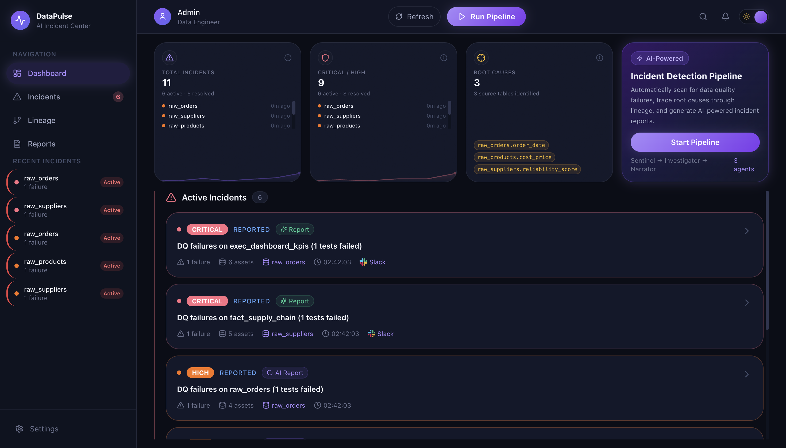
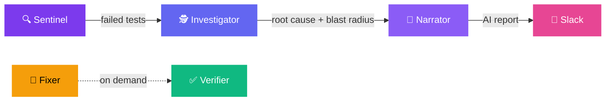
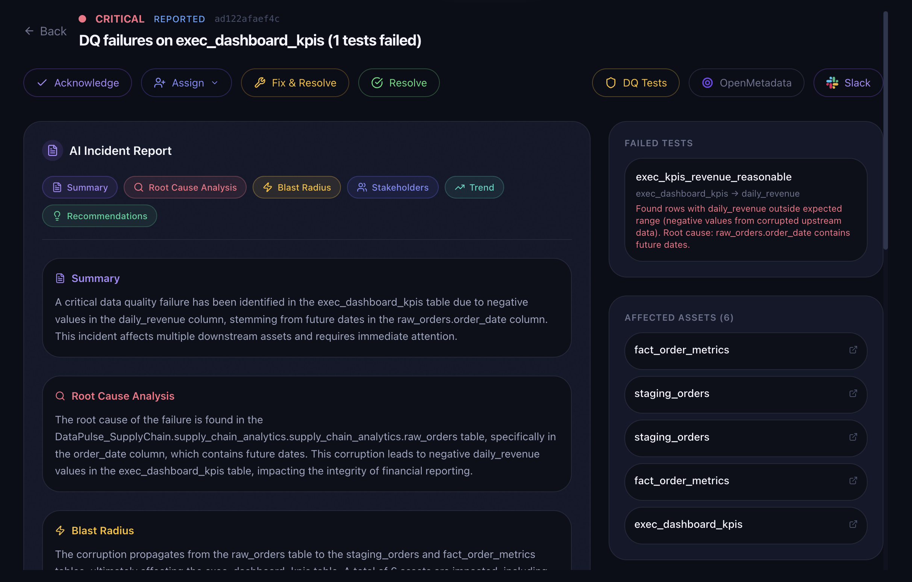
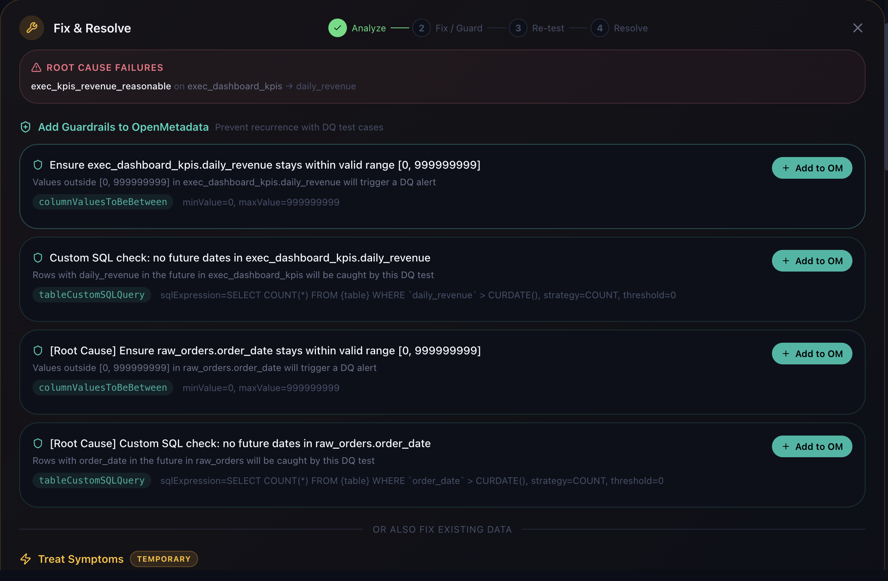
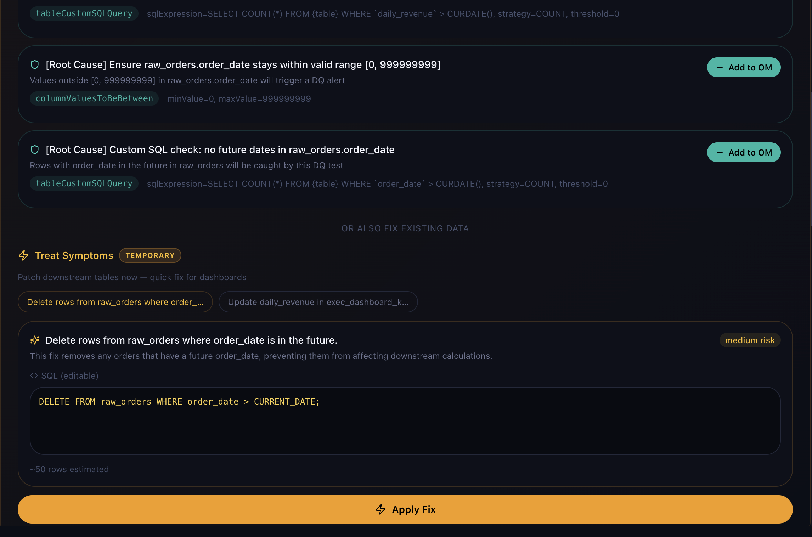
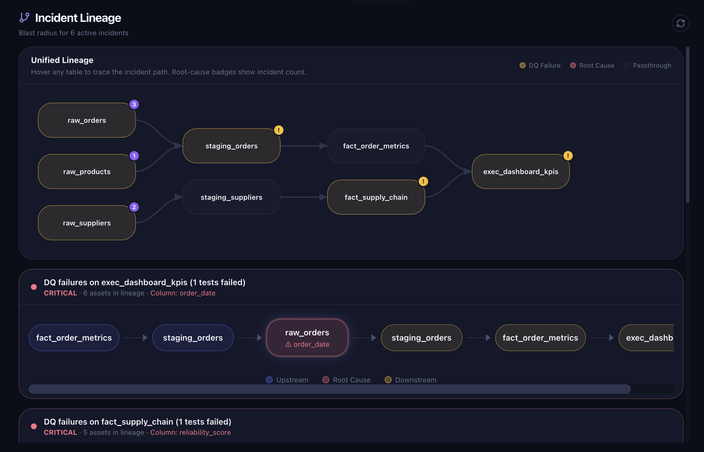
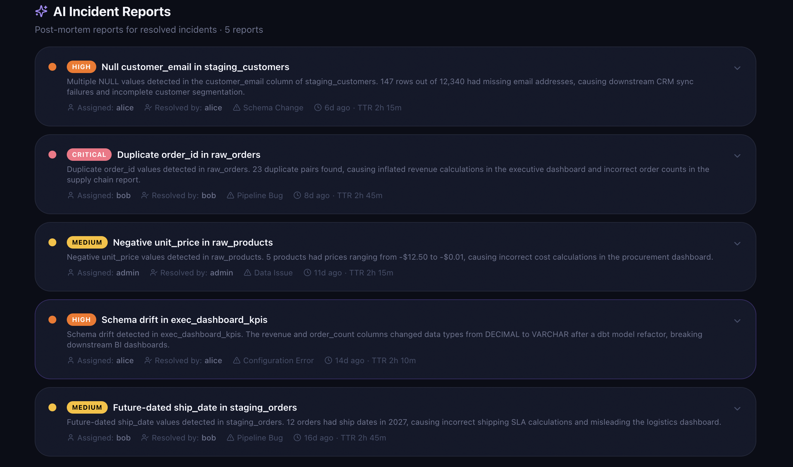
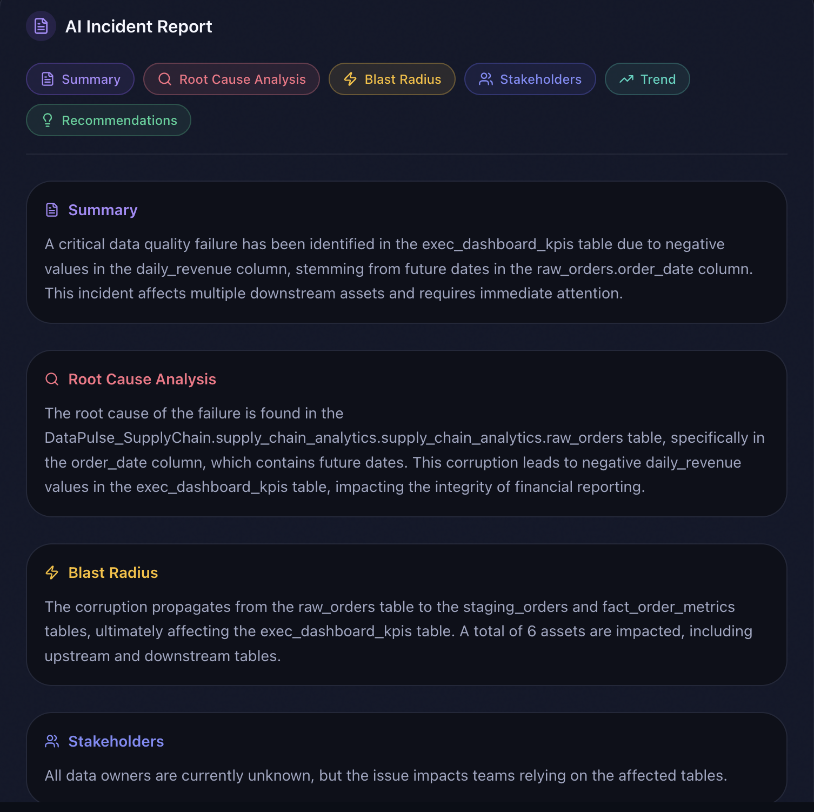
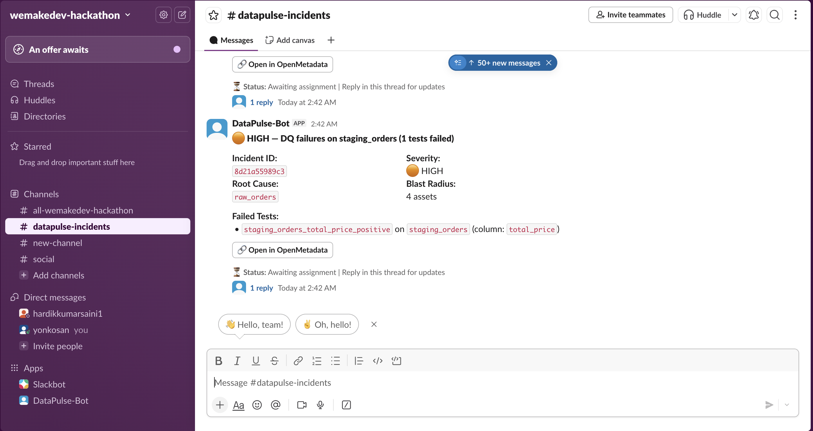
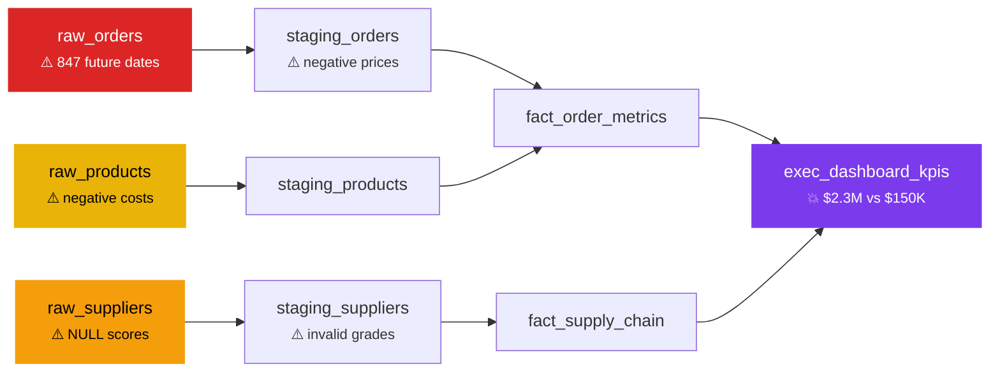

<p align="center">
  
</p>

<h1 align="center">DataPulse — AI-Powered Data Incident Command Center</h1>

<p align="center">
  <strong>From 847 corrupt rows to root cause, blast radius, and automated fix — in under 30 seconds.</strong>
</p>

<p align="center">
  <a href="#-live-demo">Live Demo</a> •
  <a href="#-the-problem">The Problem</a> •
  <a href="#-how-it-works">How It Works</a> •
  <a href="#-feature-deep-dive">Features</a> •
  <a href="#-architecture">Architecture</a> •
  <a href="#-getting-started">Getting Started</a> •
  <a href="#-api-reference">API Reference</a>
</p>

---

## 🎬 Live Demo

**[datapulse-demo.vercel.app](https://collate-ai-sdk-nxvq.vercel.app)** — Click "Run Pipeline" to see the full incident detection → investigation → AI reporting flow with sample supply chain data.

> The demo runs with seed data and simulated pipeline phases. Connect to a live OpenMetadata instance for the full experience.

---

## 🔥 The Problem

A single bad row in a source table can silently corrupt every downstream dashboard, metric, and ML feature that depends on it. Today's data teams discover these failures through:

- ❌ An angry Slack message from the CEO: *"Why does the revenue dashboard show $2.3M instead of $150K?"*
- ❌ A ticket from the ML team: *"Our model accuracy dropped 40% overnight."*
- ❌ Manual investigation across 15 tools: query logs, dbt docs, Airflow DAGs, OpenMetadata lineage...

**DataPulse eliminates this entire firefighting cycle.** It connects to your OpenMetadata instance, detects DQ failures, traces them upstream to the root cause table via column-level lineage, maps the full downstream blast radius, generates an AI incident report, suggests SQL fixes, deploys guardrails, and notifies your team on Slack — all autonomously, all in one pipeline run.

---

## ⚡ How It Works

DataPulse runs a **5-agent pipeline** that turns raw DQ test failures into fully investigated, actionable incidents:



| Agent | Role | How |
|-------|------|-----|
| **Sentinel** | Scans for DQ failures | Polls OpenMetadata's DQ API, groups failures by table, fetches faulty row samples directly from MySQL, pulls 30-day test history |
| **Investigator** | Traces root cause & blast radius | BFS-walks upstream lineage to find the originating table/column, BFS-walks downstream to map every affected asset, collects owners and tier metadata |
| **Narrator** | Generates AI incident report | GPT-4o-mini produces structured analysis: root cause, blast radius description, severity justification, trend analysis, and actionable recommendations |
| **Fixer** | Suggests & applies fixes | Generates SQL fix suggestions (root cause vs. symptom), executes fixes with safety guardrails, creates DQ test cases in OpenMetadata, re-runs tests |
| **Verifier** | Validates resolution | Re-checks DQ test results from OpenMetadata, validates that the resolution note aligns with the actual failure via LLM, rejects premature closes |

<p align="center">
  
  <br />
  <em>Real-time pipeline streaming — each phase updates live via Server-Sent Events</em>
</p>

---

## 🎯 Feature Deep Dive

### 1. Real-Time Pipeline with SSE Streaming

DataPulse doesn't just run a pipeline and dump results — it **streams every phase to the UI in real-time** via Server-Sent Events:

- Phase updates: *"Scanning OpenMetadata for DQ failures…"* → *"Tracing column-level lineage…"* → *"Generating AI reports…"*
- Incidents appear one-by-one as they're detected, not all at once
- AI reports generate asynchronously in background threads — the UI polls and reveals them when ready

<p align="center">
  
  <br />
  <em>Incidents detected and grouped by severity — each card shows failure count, blast radius, root cause table, and assigned owner</em>
</p>

---

### 2. Total Incidents vs. Unique Root Causes

The dashboard KPI cards don't just count failures — they surface the insight that matters: **how many unique upstream sources are causing all these cascading problems?**

- **Total Incidents**: Every DQ failure cluster detected across all pipeline runs (active + historical)
- **Critical / High**: Severity is determined by blast radius depth, number of downstream assets affected, and whether executive-level dashboards are impacted
- **Root Causes**: Unique upstream source tables identified as the origin of cascading failures, traced via column-level lineage — fixing these tables resolves all downstream symptoms

> **Example from our supply chain demo**: 3 active incidents across 5 failing test cases, but only **2 unique root causes** (`raw_orders.order_date` and `raw_suppliers.reliability_score`). Fix those two columns and all 5 tests pass again.

---

### 3. Incident Detail Panel

Click any incident to open the full investigation view — everything you need to understand, triage, and fix the issue in one screen:

<p align="center">
  
  <br />
  <em>Full incident detail — severity badge, action bar, AI report, affected assets, failure history, and event timeline</em>
</p>

**What you see:**

- **Severity badge** with color coding (CRITICAL = red, HIGH = orange, MEDIUM = yellow)
- **Status timeline** showing the incident lifecycle (detected → investigated → reported → acknowledged → resolved)
- **Action bar** with one-click Acknowledge, Assign (searchable user dropdown from OpenMetadata), Fix & Resolve wizard, and manual Resolve
- **Three deep-link buttons** in the top-right:
  - 🔗 **DQ Tests** — opens the exact table's data quality page in OpenMetadata (`/table/{fqn}/profiler/data-quality`)
  - 🟢 **OpenMetadata** — opens the root cause table in OpenMetadata's UI for full context
  - 💬 **Slack** — jumps to the incident's Slack thread for async collaboration

---

### 4. Unified Lineage Graph

This is not a simple parent-child tree. DataPulse merges **all active incidents into a single unified DAG** — giving your team a real-time view of how data corruption propagates through your entire pipeline:

<p align="center">
  
  <br />
  <em>Unified lineage graph — red nodes are root causes, orange nodes have DQ failures, grey nodes are passthrough tables in the blast radius</em>
</p>

**What makes this special:**

- **Color-coded nodes**: Root cause tables (red), tables with failing DQ tests (amber), passthrough tables in the blast path (grey)
- **Root cause badges**: Each root cause node shows the number of incidents originating from it
- **Interactive hover highlighting**: Hover any node to highlight the full incident path — from root cause upstream to all affected downstream tables, with BFS edge tracing
- **Metadata on every node**: Tier badges (Tier 1, Tier 2, Tier 3) and owner names so you know who to page
- **Topological layout**: Left-to-right layering with SVG bezier curves, automatically computed column/row positions
- **Auto-merged**: If two incidents share a common table (e.g., `exec_dashboard_kpis` is affected by both `raw_orders` and `raw_suppliers`), it appears as one node with multiple incoming highlighted paths

> **Example**: Hover over `raw_orders` and watch the path light up through `staging_orders` → `fact_order_metrics` → `exec_dashboard_kpis`. Now hover `raw_suppliers` — the path goes through `staging_suppliers` → `fact_supply_chain` → same `exec_dashboard_kpis`. One executive dashboard, two root causes, instant visibility.

---

### 5. AI-Generated Incident Report

Every incident gets a structured AI report generated by GPT-4o-mini, designed to be **executive-readable and action-oriented**:

<p align="center">
  
  <br />
  <em>AI-generated report with root cause analysis, blast radius description, severity justification, and actionable recommendations</em>
</p>

**Report sections:**

| Section | What It Contains |
|---------|-----------------|
| **Summary** | One-paragraph overview of what's wrong and how bad it is |
| **Root Cause Analysis** | Why the failure happened — traces the data lineage back to the source issue (e.g., *"847 rows in raw_orders have order_date values up to 2027-11-15, consistent with a timezone misconfiguration"*) |
| **Blast Radius** | Describes every downstream asset affected with concrete impact (e.g., *"exec_dashboard_kpis showing $2.3M instead of expected $150K"*) |
| **Severity Justification** | Why this severity level was assigned — references blast radius depth, Tier 1 asset impact, executive stakeholders |
| **Recommendations** | 3-5 specific, actionable steps — including exact SQL fixes, guardrail suggestions, and process improvements |
| **Stakeholders Affected** | Teams and individuals who need to know |
| **Trend Analysis** | Is this recurring? When did it start? Is it getting worse? |

Reports generate asynchronously — the UI shows a loading skeleton while GPT-4o-mini works, then smoothly reveals the report when ready.

---

### 6. Fix & Resolve Wizard

The crown jewel of DataPulse: a **4-step guided wizard** that takes you from root cause analysis to verified resolution without leaving the UI:

<p align="center">
  
  <br />
  <em>AI-generated fix suggestions — root cause fixes (recommended) and symptom fixes (temporary), with editable SQL and risk levels</em>
</p>

**Step 1: Analyze** — AI generates two types of suggestions:

- **🎯 Root Cause Fixes** (recommended): SQL that fixes the source data (e.g., `UPDATE raw_orders SET order_date = CURDATE() WHERE order_date > CURDATE()`)
- **🩹 Symptom Fixes** (temporary): SQL that patches downstream symptoms (e.g., `UPDATE staging_orders SET total_price = ABS(total_price) WHERE total_price < 0`)
- Each fix shows: description, risk level (low/medium/high), estimated rows affected, and fully editable SQL

**Step 2: Fix / Guard** — Apply the fix and deploy guardrails:

- **Execute SQL**: Runs the fix against your database with safety guardrails (blocks DROP, TRUNCATE, ALTER, GRANT — only UPDATE/DELETE allowed)
- **Deploy Guardrails**: Creates new DQ test cases directly in OpenMetadata to prevent recurrence (e.g., `columnValuesToBeBetween` on `order_date` with max = today)
- After creation, shows a "View in OpenMetadata" link to the new test case

**Step 3: Re-test** — Re-runs every failing DQ test against the database and posts fresh results to OpenMetadata. Shows pass/fail status per test.

**Step 4: Resolve** — Two resolution paths:
- **Verified Resolve**: Re-checks all DQ test results from OpenMetadata. If tests still fail → resolution is **rejected** with details of which tests are still failing. If tests pass → validates that the resolution note aligns with the actual failure (LLM-powered confidence score: HIGH/MEDIUM/LOW) → marks resolved.
- **Force Resolve**: Skip verification for cases where the fix is outside the system (e.g., source system changes).

---

### 7. Incident Lifecycle Actions

<p align="center">
  
  <br />
  <em>Full incident lifecycle — acknowledge, assign to team members, fix with guided wizard, and resolve with verification</em>
</p>

Every action syncs bidirectionally with OpenMetadata:

| Action | What Happens | OM Sync |
|--------|-------------|---------|
| **Acknowledge** | Marks incident as acknowledged, records who and when | Updates `testCaseIncidentStatus` to `Acknowledged` |
| **Assign** | Searchable dropdown of OM users, assigns owner | Updates status with assignee |
| **Fix & Resolve** | Opens the 4-step wizard (described above) | Creates test cases, posts test results |
| **Resolve** | Closes incident with resolution note and category | Updates status to `Resolved` |

**Resolution categories**: `data_fix`, `config_change`, `source_system_fix`, `known_issue`, `false_positive`, `other`

---

### 8. Slack Integration

DataPulse posts **threaded Slack notifications** for every incident lifecycle event using Block Kit rich messages:

**Thread structure:**
1. 🚨 **New incident** — Severity badge, root cause table, blast radius count, failing tests list, "Open in OpenMetadata" button
2. 📝 **AI report** — Full report posted as a thread reply
3. 👤 **Assignment** — "Assigned to @bob"
4. ✅ **Acknowledgment** — "Acknowledged by @alice"
5. 🔧 **Fix applied** — SQL code block showing exactly what was executed, rows affected
6. 🔄 **Test re-run** — Pass/fail results per test case
7. ✅ / ❌ **Verification** — Passed with confidence level, or failed with still-failing tests
8. 📋 **Resolution summary** — Time to resolution, actors chain, verification status, resolution category

> Configure with `SLACK_BOT_TOKEN` and `SLACK_CHANNEL_ID` environment variables. Slack is optional — DataPulse works fully without it.

---

### 9. Faulty Row Samples

DataPulse doesn't just tell you *that* data is bad — it shows you **exactly which rows are wrong and why**:

- Sentinel queries the actual MySQL database to fetch up to 5 sample faulty rows per failing test
- Maps each DQ test definition to the appropriate SQL WHERE clause (e.g., `columnValuesToBeNotNull` → `WHERE column IS NULL`)
- Each row displays the full row data + a human-readable reason

> **Example**: For the `raw_orders_order_date_between` failure, you see:
> ```
> order_id: 4012 | order_date: 2027-03-18 | customer_id: 289 | quantity: 5
> Reason: order_date is in the future
> ```

---

### 10. Failure History & Trend Analysis

Every incident includes historical test results to answer: *"Is this a one-time blip or a recurring problem?"*

- **Sparkline charts**: 30-day pass/fail history per test case — green dots for passes, red for failures
- **Recurring failure detection**: Automatically flags tests that have failed multiple times recently
- **First failure timestamp**: Pinpoints when the issue started
- **Trend in AI report**: The Narrator agent incorporates history into its analysis (e.g., *"This is a recurring issue — row count increased from 845 to 847, suggesting new future-dated rows are still being ingested"*)

---

## 🏗️ Architecture

```
┌─────────────────────────────────────────────────────────┐
│                    React + TypeScript UI                  │
│  Dashboard • Incidents • Unified Lineage • Reports       │
│  SSE streaming • Dark/light theme • Demo mode            │
└──────────────────────┬──────────────────────────────────┘
                       │ /api/*
┌──────────────────────▼──────────────────────────────────┐
│                   FastAPI Backend                         │
│  17 REST endpoints • SSE streaming • SQL execution       │
└───────┬───────────┬──────────────┬──────────────────────┘
        │           │              │
   ┌────▼────┐ ┌────▼─────┐  ┌────▼──────┐
   │OpenMeta-│ │  MySQL   │  │  GPT-4o   │
   │  data   │ │ Database │  │   -mini   │
   │  API    │ │ (source) │  │           │
   └─────────┘ └──────────┘  └───────────┘
        │
   ┌────▼────┐
   │  Slack  │
   │  API    │
   └─────────┘
```

### Tech Stack

| Layer | Technology |
|-------|-----------|
| **Frontend** | React 18, TypeScript, Vite, Tailwind CSS, Lucide Icons |
| **Backend** | Python 3.9+, FastAPI, Uvicorn, SSE (sse-starlette) |
| **AI** | OpenAI GPT-4o-mini (temperature=0.3, JSON response format) |
| **Metadata** | OpenMetadata REST API (DQ, lineage, users, test cases) |
| **Database** | MySQL (source database for faulty row queries + fix execution) |
| **Notifications** | Slack Block Kit API (threaded incident notifications) |
| **Deployment** | Vercel (frontend), Docker (backend + MySQL + OpenMetadata) |

---

## 🚀 Getting Started

### Prerequisites

- Python 3.9+
- Node.js 18+
- Docker & Docker Compose
- OpenMetadata instance (or use our bootstrap provisioner)
- OpenAI API key

### 1. Clone & Install

```bash
git clone https://github.com/yonkosan/collate-ai-sdk.git
cd collate-ai-sdk/solutions/ai_data_sre

# Backend dependencies
pip install -r requirements.txt

# Frontend dependencies
cd web && npm install && cd ..
```

### 2. Start Infrastructure

```bash
# Start MySQL + OpenMetadata via Docker
docker compose -f docker/docker-compose.yml up -d

# Provision the supply chain demo pipeline (tables, lineage, DQ tests)
python3 -m bootstrap.provision_metadata
```

### 3. Configure Environment

```bash
export OPENMETADATA_HOST=http://localhost:8585/api
export OPENMETADATA_TOKEN=<your-om-jwt-token>
export OPENAI_API_KEY=<your-openai-key>
export MYSQL_HOST=localhost
export MYSQL_PORT=3306
export MYSQL_USER=openmetadata_user
export MYSQL_PASSWORD=openmetadata_password
export MYSQL_DATABASE=supply_chain

# Optional: Slack notifications
export SLACK_BOT_TOKEN=xoxb-...
export SLACK_CHANNEL_ID=C...
```

### 4. Run

```bash
# Start backend
python3 -m uvicorn api.server:app --reload --port 8000

# Start frontend (in another terminal)
cd web && npm run dev
```

Open **http://localhost:3001** → Click **"Run Pipeline"** → Watch DataPulse detect, investigate, and report on DQ incidents in real-time.

---

## 📡 API Reference

### Pipeline

| Method | Endpoint | Description |
|--------|----------|-------------|
| `POST` | `/api/pipeline/run` | Run full detection pipeline (synchronous) |
| `GET` | `/api/pipeline/stream` | Stream pipeline execution via SSE (phases + incidents) |

### Incidents

| Method | Endpoint | Description |
|--------|----------|-------------|
| `GET` | `/api/incidents` | List all incidents from last pipeline run |
| `GET` | `/api/incidents/{id}` | Get full incident detail with report, blast radius, events |
| `PUT` | `/api/incidents/{id}/ack` | Acknowledge an incident |
| `PUT` | `/api/incidents/{id}/assign` | Assign incident to a user |
| `PUT` | `/api/incidents/{id}/resolve` | Resolve with optional DQ verification |
| `POST` | `/api/incidents/{id}/verify` | Dry-run verification (check if DQ tests pass) |

### Fix & Guard

| Method | Endpoint | Description |
|--------|----------|-------------|
| `POST` | `/api/incidents/{id}/suggest-fix` | AI-generated SQL fix + guardrail suggestions |
| `POST` | `/api/incidents/{id}/execute-fix` | Execute SQL fix against database |
| `POST` | `/api/incidents/{id}/rerun-test` | Re-run a DQ test and post result to OpenMetadata |
| `POST` | `/api/incidents/{id}/add-guardrail` | Create a DQ test case in OpenMetadata |

### Integration

| Method | Endpoint | Description |
|--------|----------|-------------|
| `GET` | `/api/users` | Search OpenMetadata users (for assignment) |
| `GET` | `/api/teams` | List OpenMetadata teams |
| `GET` | `/api/om/link/{type}/{fqn}` | Generate deep link into OpenMetadata UI |
| `GET` | `/api/config` | Frontend configuration (om_base_url) |
| `GET` | `/api/health` | Health check |

---

## 🧪 Supply Chain Demo Scenario

DataPulse ships with a **fully provisioned supply chain analytics pipeline** that demonstrates real-world DQ failure patterns:



**8 tables** with column-level lineage, **8 DQ test cases** (5 seeded to fail), **3 teams** with ownership, **glossary terms**, **PII tags**, and **domain classification** — all auto-provisioned by `bootstrap/provision_metadata.py`.

---

## 🤝 Built With

<p align="center">
  <a href="https://open-metadata.org">
    
  </a>
  &nbsp;&nbsp;&nbsp;&nbsp;
  <a href="https://github.com/yonkosan/collate-ai-sdk">
    
  </a>
</p>

- **[OpenMetadata](https://open-metadata.org)** — DQ test results, column-level lineage, user/team management, test case creation
- **[Collate AI SDK](https://github.com/yonkosan/collate-ai-sdk)** — AI agent invocation and SSE streaming
- **[OpenAI GPT-4o-mini](https://platform.openai.com)** — Incident report generation, fix suggestion, resolution validation
- **[Slack Block Kit](https://api.slack.com/block-kit)** — Rich threaded incident notifications

---

## 📄 License

This project is part of the [WeMakeDevs × OpenMetadata Hackathon](https://github.com/open-metadata/OpenMetadata). Built with ❤️ by the DataPulse team.(which is a single guy by the way.)
